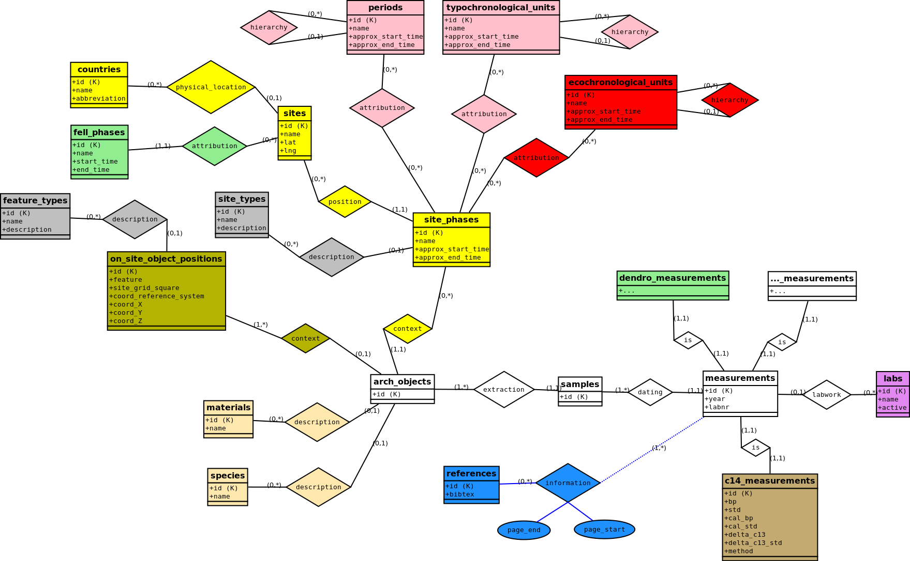

# xronos database structure models

The database was 

1. ... modelled with an Entity Relationship (ER) diagram: **xronos_erd.dia**. (This file can be opened and edited with the diagram editor software [Dia](http://dia-installer.de/).)  

2. ... and then manually translated to a relational ("table") model structure: **xronos_rdm.mwb**. (This file can be opened and edited with the database management tool [MySQL Workbench](https://www.mysql.com/products/workbench/).) 

## The Entity Relationship diagram

### How to read it

