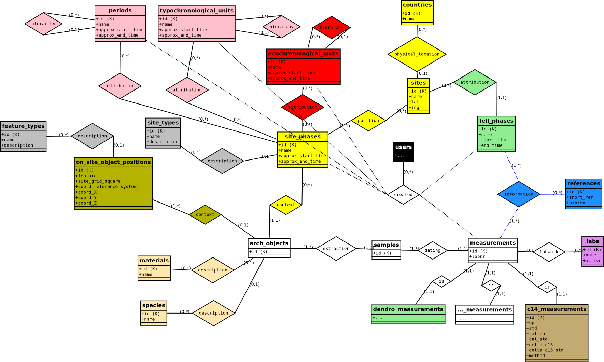

# xronos database structure models

The database was modelled with an Entity Relationship (ER) diagram: **xronos_erd.dia**. (This file can be opened and edited with the diagram editor software [Dia](http://dia-installer.de/).)

## The Entity Relationship diagram

### How to read it

*the examples are not necessarily taken from this ER chart*

- Boxes: Entity. An entity is a class of objects in the real world (e.g. *archaeological sites*) that can be described with a set of attributes (e.g. *name, number of documented houses, spatial position*). All entities will become tables in database.
- Diamonds: Relationship. Relationships describe the relations and interaction of entities (e.g. the *radiocarbon laboratory* is linked to the *sample* via the process of *measurement*). Some relationships have additional arguments (the *measurement* produces a *labnr*, happens at a certain *time* and has a specific *price* tag). Some relationships will become tables in the database, others won't. That depends on the nature of the relationship.
- Lines: Lines connect entities and relationships. Each line has a label to describe the amount of objects within an entity that can or have to be part of that relationship. Some examples: *(0,\*)*: Zero or many objects can be part of that that relationship. *(1,1)*: Exactly one object can be part of that relationship. That also implies that each object has to have exactly one partner in this specific relationship. *(0,1)*: Each object linked to the relationship has zero or one partner within the other linked entity. 

